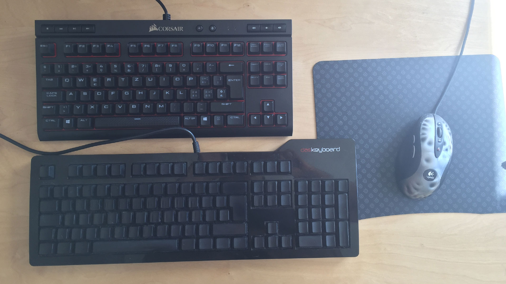

Although coding is more of an exercise in thinking than in typing, improved typing can be great.

# Mechanical Keyboard Switches

Mechanical keyboards are keyboards that have mechanical keyboard switches.
Keyboard switches are the springy part below the keyboard keys.

Some keyboard switches are linear and some tactile.

If they are tactile, you don't need to press the keys to the end. It feels like you are _caressing_ the keys.

Why? Because it's easier to type faster without looking at the keyboard.

Warning: I've used clicky keyboards in the past. They sound great, but personally I get tired of the noise after some hours.

# Keyboard sizes

There are several keyboard sizes. The most widely known are:

- Full-size keyboard (100%)
- TenkeyLess keyboards, has no numpad (80%)
- Compact keyboards (60%)

You can see 80% (Corsair K63, MX Red switches) and 100% (Das keyboard ultimate, MX blue switches) keyboards in the image below.

I've recently changed to an 80% keyboard. A smaller keyboard means that the distance between going from the mouse to the keyboard is shorter. It's also more ergonomic.

The biggest issue with the 80% size is that I lost the enter key on the numpad. I solved it by mapping my caps lock key to the enter key. The enter on the caps lock key seems great even on 100% keyboards. Some people prefer to map the ESC to the caps lock.

# Keyboard layouts and compatibility

You may start looking for a keyboard and get stuck on the layout. I'm using a Swiss layout and online stores with this layout are rare.

There's an alternative. You can buy the keycap set. Basically, you buy the little caps to put on the switches.
You should be aware of the following:

- What is your keyboard size
- Is your layout ISO or ANSI? On the ISO keyboards, the Enter looks like an inverted fat L.

You can make a custom keycap set. Try it here: [maxkeyboard](http://www.maxkeyboard.com/iso-layout-custom-color-cherry-mx-keycap-set-front-side-print-blank.html)

# Bonus Control

There's a technique I've been using for a long time. You can use the palm of your hand to press the Control key like seen in the image below.

# Conclusion

If you spend a lot of time typing, you should consider getting a better keyboard.

It feels like when you start using eyeglasses. You only notice how bad it was before when you change to something better.
